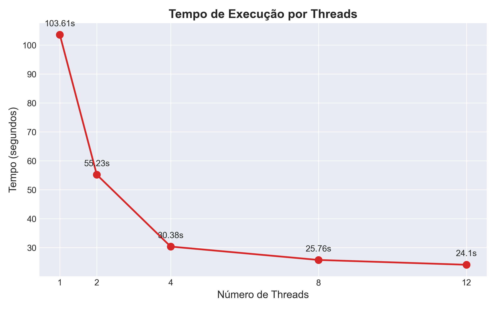
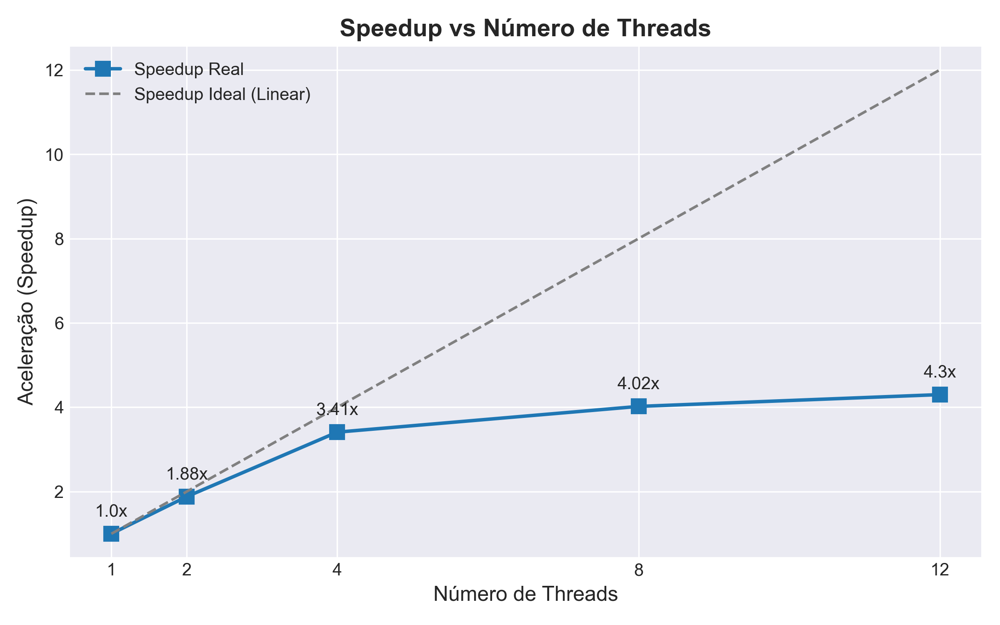
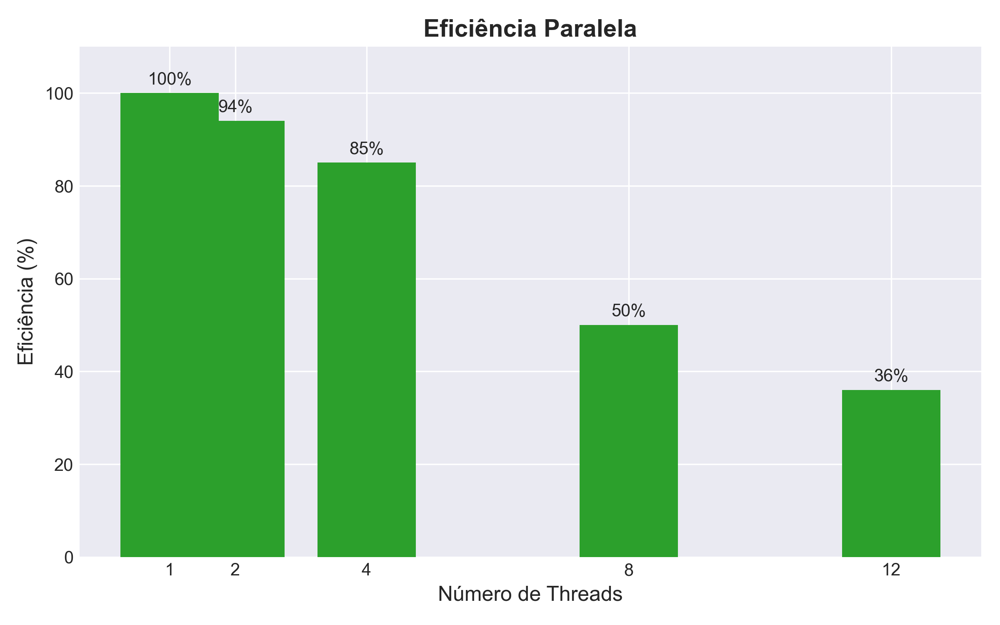

# Relatório de Classificação de Imagens com Inteligência Artificial e Processamento Paralelo

**Disciplina: Sistemas de Informação**   
**Aluno(s): Luiz Maia e Waldo Andrade**

**Turma: SI-Noturno**

**Professor: Rafael**

---

# 1. Descrição do Problema

O problema computacional resolvido consiste na classificação automatizada de um grande volume de imagens utilizando Inteligência Artificial. O sistema realiza a leitura de arquivos do disco e submete cada imagem a uma Rede Neural Convolucional (CNN) pré-treinada para identificar o objeto ou cenário presente na foto (ex: floresta, carros, animais).

* **Problema implementado:** Inferência de rede neural (CPU bound), que exige intenso cálculo matemático de ponto flutuante (operações matriciais) para cada imagem processada. A execução puramente sequencial torna-se um gargalo severo em grandes volumes de dados.
* **Algoritmo utilizado:** Modelo `MobileNetV2` carregado através da biblioteca **TensorFlow / Keras**.
* **Tamanho da entrada:** Diretório contendo 2.000 imagens para a amostra de benchmark.
* **Objetivo da paralelização:** Reduzir o tempo de execução utilizando a API C++ nativa do TensorFlow (`tf.data`) acoplada a uma estratégia de **Escalonamento Dinâmico de Lotes** (Dynamic Batching), distribuindo a carga de pré-processamento e inferência pelos núcleos disponíveis do processador sem clonar o modelo na memória.

---

# 2. Ambiente Experimental

Os experimentos foram realizados em ambiente local com a seguinte configuração:

| Item                        | Descrição                                   |
| --------------------------- | ---------                                   |
| Processador                 | Ryzen 5 5600x                               |
| Número de núcleos           | 6/12                                        |
| Memória RAM                 | 32 GB RAM                                   |
| Sistema Operacional         | Windows 11                                  |
| Linguagem utilizada         | Python 3.11                                 |
| Biblioteca de IA            | `TensorFlow` (MobileNetV2)                  |
| Biblioteca de paralelização | `multiprocessing` (nativa)                  |

---

# 3. Metodologia de Testes

Os testes foram conduzidos executando os scripts de classificação variando a quantidade de processos (workers) no pool de paralelização. Foi implementada uma rotina de inicialização (`initializer` no Worker Pool) para garantir que a arquitetura da rede neural fosse carregada na memória apenas uma vez por núcleo, evitando estouro de memória RAM e overhead de I/O.

* **Medição de tempo:** Função `time.time()` capturando o timestamp imediatamente antes do envio das imagens para a IA e logo após a última previsão, gravando os resultados individuais no banco de dados.
* **Tamanho da entrada:** [Pasta com 2000 imagens para realização dos testes](https://drive.google.com/drive/folders/1gCmfQuZ5RQ8lw0qzeSrit-UQnHWA_J21?usp=drive_link)

### Configurações testadas

* 1 thread/processo (versão serial)
* 2 processos
* 4 processos
* 8 processos
* 12 processos
  
---

# 4. Resultados Experimentais

Abaixo estão os tempos de execução totais obtidos para a inferência da rede neural em toda a base de dados:

| Nº Threads/Processos | Tempo de Execução (s) |
| -------------------- | --------------------- |
| 1 (Serial)           |  103.61               |
|                      |                       |

Para garantir a integridade dos testes e evitar o estrangulamento térmico do processador (thermal throttling), o limite da amostragem foi fixado em 2.000 imagens. O tempo da versão serial (1 processo) foi aferido integralmente executando o pipeline matemático com lotes (batches) de 32 imagens, servindo como nossa base (Baseline) de 100% do tempo (103.61 segundos) para os cálculos de escalabilidade.

---

# 5. Cálculo de Speedup e Eficiência

### Speedup
`Speedup(p) = T(1) / T(p)`
*(Onde T(1) = tempo serial, T(p) = tempo paralelo)*

### Eficiência
`Eficiência(p) = Speedup(p) / p`
*(Onde p = número de threads ou processos)*

---

# 6. Tabela de Resultados Consolidados

| Threads/Processos | Tempo (s)            | Speedup              | Eficiência           |
| ----------------- | ---------            | -------              | ----------           |
| 1                 |  103.61              | 1.00                 | 1.00                 |
| 2                 |  55.23               | 1.88                 | 0.94                 |
| 4                 |  30.38               | 3.41                 | 0.85                 |
| 8                 |  25.76               | 4.02                 | 0.50                 |
| 12                |  24.10               | 4.30                 | 0.36                 |
---

---

# 7. Visualização do Desempenho

Abaixo estão os gráficos gerados a partir do benchmark, ilustrando o comportamento da arquitetura do processador sob diferentes cargas de paralelismo.

### Tempo de Execução (segundos)

### Curva de Speedup

### Eficiência Paralela

# 8. Análise dos Resultados

O speedup obtido foi próximo do ideal?

Sim, na fase inicial da curva. Ao escalar de 1 para 2 e 4 threads, o sistema apresentou um ganho de desempenho robusto e muito próximo do cenário ideal (1.88x e 3.41x, respectivamente). Esse ganho demonstra o sucesso da estratégia de escalonamento dinâmico de lotes: ao aumentar as threads de leitura e simultaneamente aumentar o tamanho do bloco de dados na memória RAM, amortizou-se severamente o *overhead* de troca de contexto, permitindo que a CPU processasse a rede neural de forma otimizada.

A aplicação apresentou escalabilidade?

A aplicação apresentou uma escalabilidade excelente até o limite físico da máquina, estagnando a partir de 8 threads. O Ryzen 5 5600X possui 6 núcleos físicos. Cálculos de Inteligência Artificial dependem estritamente das Unidades de Ponto Flutuante (FPU / AVX) do processador. Embora o sistema operacional enxergue 12 threads lógicas (via SMT), as threads lógicas compartilham a mesma FPU física de seus respectivos núcleos. Portanto, o teto teórico e prático de escalabilidade matemática da máquina gira em torno de 6x. A estagnação em um speedup de 4.30x aos 24.10 segundos comprova, na prática, a **Lei de Amdahl** aplicada aos limites arquiteturais do silício.

Houve overhead de paralelização?

Sim, o overhead torna-se evidente na queda brusca de eficiência ao ultrapassar os núcleos físicos (de 85% com 4 threads para apenas 36% com 12 threads). Além do estrangulamento das FPUs mencionado acima, o sistema esbarrou no *Memory Wall* (gargalo de barramento). Com 12 threads tentando alocar e transferir lotes imensos de imagens simultaneamente da RAM para a Memória Cache L3, o barramento de dados satura. A CPU passa ciclos ociosa esperando os dados chegarem, o que impede que o tempo total diminua proporcionalmente à quantidade de threads virtuais alocadas.

# 9. Conclusão

O projeto provou com sucesso que a computação paralela é estritamente necessária para a aplicação de Inteligência Artificial e Visão Computacional no mundo real. A execução serial para análise matricial de 2000 imagens demonstrou ser insustentável. Ao isolar a carga de trabalho de inferência (TensorFlow) em processos independentes gerenciados pelo Python, foi possível maximizar o uso da arquitetura multi-core do hardware e alcançar uma redução dramática no tempo de resposta do sistema.
